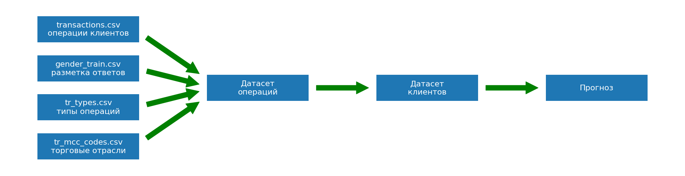

# Что это

Меня зовут Дима Алексеев. 

Это мой пет проект по решению [учебного задания Сбера на Kaggle](https://www.kaggle.com/competitions/python-and-analyze-data-final-project).

Если ссылка не открывается, ничего страшного - я дам скрины в самих файлах.

# Зачем это

Я уже прошел это задание в 2019 году с результатом на уровне middle Data Scientist. 

Теперь я иногда возвращаюсь к нему, чтобы навыки "не заржавели". 

Тогда я еще не умел пользоваться гитом и исходники не сохранились.

# Что будет

Тут будет решение задания в виде нескольких ноутбуков. 

Примерный план:

1. Загрузить исходные данные и провести их анализ
2. Собрать датасет операций
3.  Собрать датасет клиентов
4.  Составить несколько прогнозов разных моделей
5.  Выбрать лучшее решение
